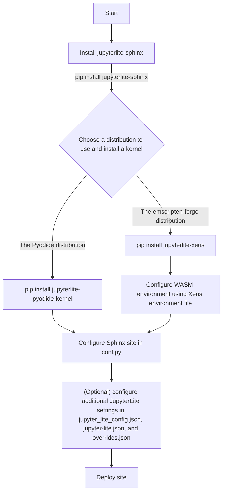

# `jupyterlite-sphinx-demo`

This repository showcases JupyterLite deployed as a static site on GitHub Pages as a part of a [Sphinx](https://www.sphinx-doc.org/) site using [the `jupyterlite-sphinx` extension](https://jupyterlite-sphinx.rtfd.io) for demo purposes. It is meant to be used as a reference for documentation website authors who want to add interactive documentation elements to their Sphinx sites.

For similar demos that deploy JupyterLite as a standalone site instead, please check out the following:

- [the JupyterLite demo](https://github.com/jupyterlite/demo) for a deployment that uses the Pyodide kernel (`jupyterlite-pyodide-kernel`).
- [the JupyterLite Xeus demo](https://github.com/jupyterlite/xeus-lite-demo/) for a deployment that uses the Xeus kernel (via `jupyterlite-xeus` and `xeus-python`).

## ✨ Try it in your browser ✨

[pyodide-badge]: https://jupyterlite.rtfd.io/en/latest/_static/badge.svg
[pyodide-url]: https://jupyterlite.github.io/sphinx-demo/pyodide/
[xeus-badge]: https://jupyterlite.rtfd.io/en/latest/_static/badge.svg
[xeus-url]: https://jupyterlite.github.io/sphinx-demo/xeus/

| Kernel                                 |                         URL                         |
| :------------------------------------- | :-------------------------------------------------: |
| Pyodide (`jupyterlite-pyodide-kernel`) | [![lite-badge-pyodide][pyodide-badge]][pyodide-url] |
| Xeus (`xeus-python` kernel)            |     [![lite-badge-xeus][xeus-badge]][xeus-url]      |

## 🗂️ Folder structure

This repository is divided into two sections:

- `pyodide-kernel-example/`: this folder contains a JupyterLite deployment with a Sphinx site using the Pyodide kernel, which is a Python kernel that runs in the browser using WebAssembly and uses [the Pyodide distribution](https://pyodide.org/en/stable/).
- `xeus-kernel-example/`: this folder contains a JupyterLite deployment with a Sphinx site using the Xeus kernel, which uses [the emscripten-forge channel](https://emscripten-forge.org/).

Both examples use the [PyData Sphinx Theme](https://pydata-sphinx-theme.readthedocs.io/en/stable/).

Please check out the README files under each folder to understand the file structure and the use of configuration files in the JupyterLite deployment.

## 📖 Walkthrough

Here is an end-to-end guide to set up your own deployment to use JupyterLite and `jupyterlite-sphinx`:

1. Install `jupyterlite-sphinx` and a kernel of your choice in your Python environment that is used to build the Sphinx documentation website. For example, you may install the Pyodide kernel with `pip install jupyterlite-sphinx jupyterlite-pyodide-kernel`. We recommend pinning the version of `jupyterlite-pyodide-kernel` as it controls the version of Pyodide that is used in the deployment.
2. Configure `jupyterlite-sphinx` in your Sphinx documentation website in its `conf.py` file.
3. Then, build the Sphinx documentation website with `make html` or `sphinx-build -b html . _build/html` (or the equivalent command for your Sphinx setup).
4. To configure the look and feel of the buttons added by `jupyterlite-sphinx`, you may use a CSS file to style it. A sample has been provided in the `/_static/` folder for each example.
5. Next, to configure the JupyterLite deployment further, you may use the `jupyter_lite_config.json`, `jupyter-lite.json`, and `overrides.json` files, and sample files have been provided in the example folders.
6. Finally, you may deploy the JupyterLite deployment to a static site hosting service such as GitHub Pages or Read the Docs alongside your Sphinx documentation website, as the JupyterLite deployment is stored within a `lite/` subfolder of the Sphinx build output.

Here is a diagram of the workflow:

## Further information

For information on how to use and configure JupyterLite and `jupyterlite-sphinx` further, please refer to [the JupyterLite documentation](https://jupyterlite.readthedocs.io/) and [the `jupyterlite-sphinx` documentation](https://jupyterlite-sphinx.rtfd.io/) respectively.

- Getting started: https://jupyterlite.readthedocs.io/en/stable/quickstart/index.html
- How-to guides: https://jupyterlite.readthedocs.io/en/stable/howto/index.html
- Reference: https://jupyterlite.readthedocs.io/en/stable/reference/index.html

For information on how to select and configure a kernel, please refer to the ["Adding kernels" section in the JupyterLite documentation](https://jupyterlite.readthedocs.io/en/stable/howto/configure/kernels.html#choosing-a-kernel).

### Websites that use `jupyterlite-sphinx`

- [NumPy](https://numpy.org/devdocs/): many of the API examples in the "latest" documentation are interactive, and use the Pyodide kernel.
- [SciPy](https://docs.scipy.org/doc/scipy/): notebooks under [the `scipy.stats` module](https://scipy.github.io/devdocs/tutorial/stats.html) are interactive, and use the Pyodide kernel.
- [`scikit-learn`](https://scikit-learn.org/stable/): uses [the Sphinx-Gallery extension](https://sphinx-gallery.github.io/stable/) to generate [a gallery of examples](scikit-learn.org/stable/auto_examples/), and uses the extension's [JupyterLite integration](https://sphinx-gallery.github.io/stable/configuration.html#jupyterlite) to make them interactive, which relies on `jupyterlite-sphinx` internally. While this is also an option that users may explore, it is not showcased within this demo.

## License

This project is licensed under the BSD 3-Clause License. See the [LICENSE](LICENSE) file for details.

Please refer to the respective licenses for individual kernels, themes, and other dependencies.
